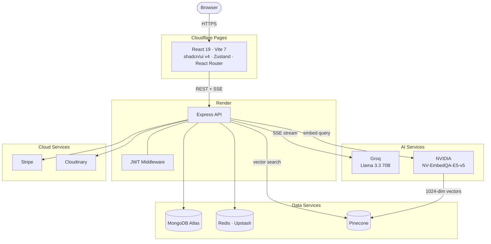

<div align="center">
  
  <h1>Luxe</h1>
  <p><strong>A full-stack luxury e-commerce platform with an AI shopping assistant powered by Llama 3.3, vector search, and real-time streaming.</strong></p>

  <p>
    <a href="https://luxe.spacesdrive.cc" target="_blank"></a>
    
    
    
    
    
    
  </p>

  <p>
    <a href="https://luxe.spacesdrive.cc">View Live Demo</a>
    &nbsp;&bull;&nbsp;
    <a href="#quick-start">Quick Start</a>
    &nbsp;&bull;&nbsp;
    <a href="#architecture">Architecture</a>
    &nbsp;&bull;&nbsp;
    <a href="#api-reference">API Reference</a>
  </p>
</div>

---

## What is Luxe?

Luxe is a production-grade luxury e-commerce store with a built-in AI shopping assistant. Users can browse six product categories, filter and search products, manage a cart, apply coupons, and check out via Stripe. The AI assistant understands natural language, searches a vector database using semantic embeddings, streams responses token-by-token, and can compare products or add items to cart directly from the chat window.

Admins get a full dashboard with revenue analytics, daily sales charts, and complete product management.

---

## Live Demo

**[https://luxe.spacesdrive.cc](https://luxe.spacesdrive.cc)**

Register a free account at the live site to browse products and test the AI assistant. To access the admin dashboard, set your user's `role` field to `"admin"` in MongoDB.

---

## Features

| Feature | Description |
|---|---|
| AI Shopping Assistant | Streams responses via SSE using Llama 3.3 70B on Groq. Understands budget, category focus, and product comparisons |
| Vector Search | Products embedded with NVIDIA NV-EmbedQA-E5-v5 (1024 dimensions) and queried through Pinecone |
| Keyword Fallback | When Pinecone is unavailable, falls back to MongoDB regex search automatically |
| JWT Authentication | 15-minute access tokens plus 7-day refresh tokens in HTTP-only cookies. Cross-origin `sameSite` handled automatically |
| Stripe Checkout | Complete payment flow with line items, coupon discounts applied via Stripe API, and order creation on success |
| Reward Coupons | Orders over $200 auto-generate a personal 10% coupon (30-day expiry) for that user |
| Admin Dashboard | Total users, products, revenue, and sales. Daily breakdown chart powered by Recharts |
| Product Management | Full CRUD for products with Cloudinary image uploads, size variants, and featured toggle |
| Six Categories | Electronics, Clothing, Accessories, Jewelry, Home, Fragrance with URL-routed category pages |
| Dark / Light Mode | System-aware theme switching with View Transitions API for a smooth cross-fade animation |
| Redis Sessions | Chat history stored in Redis with in-memory Map fallback when Redis is unavailable |
| Graceful Degradation | Server remains available if MongoDB or Redis fail on startup |

---

## Tech Stack

### Frontend

| Technology | Version | Purpose |
|---|---|---|
| React | 19 | UI framework |
| Vite | 7 | Build tool and dev server |
| shadcn/ui | v4 | Component library built on Base UI primitives |
| Tailwind CSS | v4 | Utility-first styling with OKLCH color tokens |
| next-themes | 0.4 | Dark/light mode with system detection |
| Zustand | 5 | Global state (auth, cart, products) |
| React Router | v7 | Client-side routing |
| Recharts | 3 | Admin analytics charts |
| Lucide React | latest | Icon system |

### Backend

| Technology | Version | Purpose |
|---|---|---|
| Node.js + Express | 4.19 | REST API server |
| MongoDB + Mongoose | 8.5 | Primary database |
| Redis (ioredis) | 5.4 | JWT refresh token storage and chat session cache |
| Groq SDK | 0.37 | Llama 3.3 70B inference for AI chat streaming |
| Pinecone | 7.1 | Vector database for semantic product search |
| NVIDIA NV-EmbedQA-E5-v5 | - | 1024-dimension product and query embeddings |
| Stripe | 16 | Payment processing and coupon management |
| Cloudinary | 2.4 | Product image hosting and transformation |
| jsonwebtoken | 9 | JWT signing and verification |
| bcryptjs | 2.4 | Password hashing with bcrypt (cost factor 10) |

---

## Architecture



### System Overview

| Layer | Technology | Deployment |
|---|---|---|
| Frontend SPA | React 19 + Vite 7 + shadcn/ui v4 | Cloudflare Pages |
| REST + SSE API | Node.js + Express | Render |
| Primary Database | MongoDB + Mongoose | MongoDB Atlas |
| Session Cache | Redis (ioredis) | Upstash |
| Payments | Stripe | Stripe Cloud |
| Images | Cloudinary | Cloudinary CDN |
| LLM Inference | Groq (Llama 3.3 70B) | Groq Cloud |
| Vector Search | Pinecone | Pinecone Cloud |
| Embeddings | NVIDIA NV-EmbedQA-E5-v5 | NVIDIA API |

### AI Chat Flow

1. User message arrives at `POST /api/chat`
2. Intent is classified (product search / greeting / store info / off-topic) via Groq
3. Query embedding is generated via NVIDIA NV-EmbedQA-E5-v5 (1024 dimensions)
4. Pinecone is queried for the top 8 semantic matches
5. If Pinecone is unavailable, MongoDB keyword search is used as fallback
6. Budget and category filters are applied to the matched products
7. Groq Llama 3.3 70B streams a conversational response token-by-token over SSE
8. A second Groq call extracts structured data (product IDs, cart intents, comparison pairs)
9. Conversation history is saved to Redis with a 12-turn rolling window (1h TTL)

### Authentication Flow

1. Signup or login issues an access token (15 min) and a refresh token (7 days)
2. Refresh token is stored in Redis; both tokens are set as HTTP-only cookies
3. `sameSite` is `"none"` for cross-origin deployments, `"strict"` for same-origin
4. Protected routes verify the access token via JWT middleware
5. When the access token expires, the client calls `POST /api/auth/refresh`
6. The stored Redis token is validated and a new access token is issued

---

## Quick Start

### Prerequisites

- Node.js 18 or higher
- MongoDB Atlas cluster (or local MongoDB)
- Upstash Redis (or local Redis)
- Groq API key (free at [console.groq.com](https://console.groq.com))
- Stripe account
- Cloudinary account
- Pinecone account and NVIDIA API key (required only for semantic AI search)

### 1. Clone and install

```bash
git clone https://github.com/spacesdrive/luxe.git
cd luxe
npm install
npm install --prefix frontend
```

### 2. Configure environment variables

```bash
cp .env.example .env
# Edit .env with your credentials
```

See [Environment Variables](#environment-variables) for the full list.

### 3. Start development servers

**Backend** (runs on port 5000):

```bash
npm run dev
```

**Frontend** (runs on port 5173, in a separate terminal):

```bash
cd frontend
npm run dev
```

Open [http://localhost:5173](http://localhost:5173) in your browser.

---

## Environment Variables

Create a `.env` file in the project root (not inside `frontend/`):

```env
# Server
PORT=5000
NODE_ENV=development

# URLs (no trailing slash)
FRONTEND_URL=http://localhost:5173
BACKEND_URL=http://localhost:5000

# MongoDB
MONGO_DB_URI=mongodb+srv://<user>:<password>@cluster.mongodb.net/luxe

# Redis
REDIS_URL=rediss://default:<password>@<host>:<port>

# JWT Secrets (use long random strings, minimum 32 characters each)
ACCESS_TOKEN_SECRET=your_access_token_secret
REFRESH_TOKEN_SECRET=your_refresh_token_secret

# Cloudinary
CLOUDINARY_CLOUD_NAME=your_cloud_name
CLOUDINARY_API_KEY=your_api_key
CLOUDINARY_API_SECRET=your_api_secret

# Stripe
STRIPE_SECRET_KEY=sk_test_...

# Groq (AI Chat - required for AI assistant)
GROQ_API_KEY=gsk_...

# NVIDIA (Product Embeddings - required for semantic search)
NVIDIA_API_KEY=nvapi-...

# Pinecone (Vector Search - required for semantic search)
PINECONE_API_KEY=pcsk_...
PINECONE_INDEX=luxe-products
```

The AI chat assistant and semantic search require Groq, NVIDIA, and Pinecone. Without them, the chatbot falls back to MongoDB keyword search automatically. All other features (auth, cart, checkout, admin) work independently.

---

## API Reference

### Authentication

| Method | Endpoint | Auth | Description |
|---|---|---|---|
| POST | `/api/auth/signup` | Public | Register a new user |
| POST | `/api/auth/login` | Public | Login and receive tokens in cookies |
| POST | `/api/auth/logout` | Public | Clear auth cookies |
| POST | `/api/auth/refresh` | Public | Issue a new access token from refresh token |
| GET | `/api/auth/profile` | User | Get the current authenticated user |

### Products

| Method | Endpoint | Auth | Description |
|---|---|---|---|
| GET | `/api/products` | Admin | List all products |
| POST | `/api/products` | Admin | Create a product |
| PUT | `/api/products/:id` | Admin | Update a product |
| DELETE | `/api/products/:id` | Admin | Delete a product |
| PATCH | `/api/products/:id` | Admin | Toggle featured status |
| GET | `/api/products/featured` | Public | Get featured products |
| GET | `/api/products/recommendations` | Public | Get recommended products |
| GET | `/api/products/category/:name` | Public | Get products by category (case-insensitive) |

### Cart

| Method | Endpoint | Auth | Description |
|---|---|---|---|
| GET | `/api/cart` | User | Get cart with populated product data |
| POST | `/api/cart` | User | Add a product to cart |
| DELETE | `/api/cart` | User | Clear the entire cart |
| PUT | `/api/cart/:id` | User | Update quantity for a cart item |

### Payments

| Method | Endpoint | Auth | Description |
|---|---|---|---|
| POST | `/api/payments/create-checkout-session` | User | Create a Stripe checkout session |
| POST | `/api/payments/checkout-success` | User | Confirm payment, deactivate coupon, create order |

### Coupons

| Method | Endpoint | Auth | Description |
|---|---|---|---|
| GET | `/api/coupons` | User | Get the active coupon for the current user |
| POST | `/api/coupons/validate` | User | Validate a coupon code and return discount |

### Analytics

| Method | Endpoint | Auth | Description |
|---|---|---|---|
| GET | `/api/analytics` | Admin | Summary stats and last 7 days of daily sales data |

### Chat

| Method | Endpoint | Auth | Description |
|---|---|---|---|
| POST | `/api/chat` | Public | Send a message. Returns an SSE stream |

**Request body:**

```json
{
  "message": "Show me fragrances under $100",
  "sessionId": "uuid-v4"
}
```

**SSE event format:**

```
data: {"type":"token","content":"Here are some beautiful..."}

data: {"type":"done","products":[...],"cartProducts":[...],"compareProducts":[...]}

data: {"type":"error","message":"Sorry, I'm having trouble right now."}
```

---

## Database Schema

### User

| Field | Type | Notes |
|---|---|---|
| name | String | Required |
| email | String | Required, unique, lowercase |
| password | String | Bcrypt hashed. 8-64 chars, validated against common password list |
| cartItems | Array | `[{ product, quantity, selectedSize }]` |
| role | String | `"user"` or `"admin"` |

### Product

| Field | Type | Notes |
|---|---|---|
| name | String | Required |
| description | String | Required |
| price | Number | Required, min 0 |
| image | String | Cloudinary URL |
| category | String | Electronics / Clothing / Accessories / Jewelry / Home / Fragrance |
| isFeatured | Boolean | Default false |
| sizes | [String] | Clothing sizes (XS, S, M, L, XL, XXL, 3XL) |
| shoeSizes | [String] | Shoe sizes (UK 5 through UK 12) |

### Order

| Field | Type | Notes |
|---|---|---|
| user | ObjectId | Reference to User |
| products | Array | `[{ product, quantity, price }]` |
| totalAmount | Number | Total in USD |
| stripeSessionId | String | Unique, prevents duplicate order creation |

### Coupon

| Field | Type | Notes |
|---|---|---|
| code | String | Unique, auto-generated (e.g. GIFT3K9A2F) |
| discountPercentage | Number | 0-100 |
| expirationDate | Date | 30 days from generation |
| isActive | Boolean | Set to false after use |
| userId | ObjectId | One coupon per user (unique index) |

---

## Deployment

The recommended setup is Cloudflare Pages for the frontend and Render for the backend.

### Frontend on Cloudflare Pages

| Setting | Value |
|---|---|
| Root directory | `frontend` |
| Build command | `npm install && npm run build` |
| Build output directory | `dist` |
| Environment variable | `VITE_BACKEND_URL=https://your-app.onrender.com` |

### Backend on Render

| Setting | Value |
|---|---|
| Root directory | `/` |
| Build command | `npm install` |
| Start command | `node backend/server.js` |
| Environment | Add all variables from [Environment Variables](#environment-variables) |

**Keeping the free tier awake:** Render's free tier spins down after 15 minutes of inactivity (30-second cold start on next request). Use [UptimeRobot](https://uptimerobot.com) (free, no card) to monitor your Render URL every 5 minutes.

---

## Project Structure

```
luxe/
├── backend/
│   ├── controllers/        Route handlers (auth, products, cart, payments, chat, analytics)
│   ├── lib/                DB, Redis, Cloudinary, Stripe clients and env config
│   ├── middleware/         JWT protection and admin guard middleware
│   ├── models/             Mongoose schemas (User, Product, Order, Coupon)
│   ├── routes/             Express routers
│   ├── services/           Groq streaming, NVIDIA embeddings, Pinecone, intent detection
│   └── server.js           Application entry point
├── frontend/
│   └── src/
│       ├── api/            Axios instance and base URL config
│       ├── components/     Navbar, ProductCard, ChatBot, shadcn/ui components, registry blocks
│       ├── hooks/          Custom React hooks
│       ├── lib/            Utility functions (cn, class merging)
│       ├── pages/          Route pages (Home, Shop, Product, Cart, Admin, Login, Signup)
│       ├── store/          Zustand stores (useAuthStore, useCartStore, useProductStore)
│       ├── App.jsx         React Router layout and route definitions
│       ├── index.css       OKLCH luxury gold theme variables and global styles
│       └── main.jsx        React 19 entry point with ThemeProvider
└── package.json            Root scripts: dev, start, build
```

---

## Contributing

Contributions are welcome. To contribute:

```bash
# 1. Fork the repository and create a branch
git checkout -b feature/your-feature-name

# 2. Install dependencies
npm install && npm install --prefix frontend

# 3. Make your changes and run both dev servers to verify

# 4. Commit with a descriptive message following conventional commits
git commit -m "feat: add your feature description"

# 5. Push and open a pull request against main
git push origin feature/your-feature-name
```

For significant changes, open an issue first to discuss the approach. Bug reports should include steps to reproduce and the expected versus actual behavior.

---

## License

MIT License. See [LICENSE](LICENSE) for details.

---

<div align="center">
  <p>Built with React 19, shadcn/ui v4, Groq Llama 3.3, and Stripe.</p>
  <a href="https://luxe.spacesdrive.cc">luxe.spacesdrive.cc</a>
</div>
